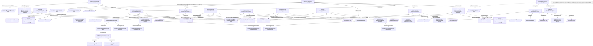

# Dependency Graph

> Auto-generated by `npm run gen:specs`. Do not edit.

---

```mermaid
%%{init: {'flowchart': {'useMaxWidth': false}}}%%
flowchart TD
    polling_poll-validated_poll-validated["polling/poll-validated/poll-validated"]
    polling_poll-validated_steps_mediate-all["polling/poll-validated/steps/mediate-all"]
    shared_safe-generate-id["shared/safe-generate-id"]
    dispatches_create-dispatch_create-dispatch["dispatches/create-dispatch/create-dispatch"]
    incoming-processing_mediate-processing_mediate-processing["incoming-processing/mediate-processing/mediate-processing"]
    incoming-processing_fail-processing_fail-processing["incoming-processing/fail-processing/fail-processing"]
    mediation_mediate_core_mediate["mediation/mediate/core/mediate"]
    polling_poll-received_poll-received["polling/poll-received/poll-received"]
    incoming-processing_validate-processing_validate-processing["incoming-processing/validate-processing/validate-processing"]
    polling_poll-received_steps_classify-validation-results["polling/poll-received/steps/classify-validation-results"]
    polling_poll-dispatches_poll-dispatches["polling/poll-dispatches/poll-dispatches"]
    dispatches_record-delivery_record-delivery["dispatches/record-delivery/record-delivery"]
    polling_poll-dispatches_steps_classify-delivery-results["polling/poll-dispatches/steps/classify-delivery-results"]
    mediation_mediate_steps_execute-filters["mediation/mediate/steps/execute-filters"]
    mediation_mediate_steps_evaluate-filter-step["mediation/mediate/steps/evaluate-filter-step"]
    mediation_mediate_steps_resolve-field["mediation/mediate/steps/resolve-field"]
    mediation_mediate_steps_compose-results["mediation/mediate/steps/compose-results"]
    mediation_mediate_steps_execute-transforms["mediation/mediate/steps/execute-transforms"]
    mediation_deactivate-mediation_deactivate-mediation["mediation/deactivate-mediation/deactivate-mediation"]
    mediation_safe-get-mediation-by-id["mediation/safe-get-mediation-by-id"]
    shared_safe-generate-timestamp["shared/safe-generate-timestamp"]
    mediation_deactivate-mediation_core_deactivate-mediation["mediation/deactivate-mediation/core/deactivate-mediation"]
    mediation_shared_steps_check-deactivatable-state["mediation/shared/steps/check-deactivatable-state"]
    mediation_shared_steps_assemble-deactivated-mediation["mediation/shared/steps/assemble-deactivated-mediation"]
    mediation_create-mediation_create-mediation["mediation/create-mediation/create-mediation"]
    mediation_shared_steps_assemble-draft-mediation["mediation/shared/steps/assemble-draft-mediation"]
    mediation_activate-mediation_activate-mediation["mediation/activate-mediation/activate-mediation"]
    mediation_activate-mediation_core_activate-mediation["mediation/activate-mediation/core/activate-mediation"]
    mediation_shared_steps_check-activatable-state["mediation/shared/steps/check-activatable-state"]
    mediation_shared_steps_assemble-active-mediation["mediation/shared/steps/assemble-active-mediation"]
    incoming-processing_safe-get-incoming-processing-by-id["incoming-processing/safe-get-incoming-processing-by-id"]
    shared_safe-resolve-schema["shared/safe-resolve-schema"]
    incoming-processing_validate-processing_core_validate-processing["incoming-processing/validate-processing/core/validate-processing"]
    incoming-processing_receive-event_receive-event["incoming-processing/receive-event/receive-event"]
    incoming-processing_receive-event_core_receive-event["incoming-processing/receive-event/core/receive-event"]
    incoming-processing_mediate-processing_core_mediate-processing["incoming-processing/mediate-processing/core/mediate-processing"]
    incoming-processing_fail-processing_core_fail-processing["incoming-processing/fail-processing/core/fail-processing"]
    dispatches_safe-get-dispatch-by-id["dispatches/safe-get-dispatch-by-id"]
    dispatches_safe-deliver["dispatches/safe-deliver"]
    dispatches_record-delivery_core_record-delivery["dispatches/record-delivery/core/record-delivery"]
    dispatches_create-dispatch_core_create-dispatch["dispatches/create-dispatch/core/create-dispatch"]
    dep_0[/"findIncomingProcessingsByState (dep)"/]
    polling_poll-validated_poll-validated -.->|findIncomingProcessingsByState| dep_0
    dep_1[/"findActiveMediationsByTopic (dep)"/]
    polling_poll-validated_poll-validated -.->|findActiveMediationsByTopic| dep_1
    dep_2[/"getTransformRegistry (dep)"/]
    polling_poll-validated_poll-validated -.->|getTransformRegistry| dep_2
    polling_poll-validated_poll-validated -->|mediateAll| polling_poll-validated_steps_mediate-all
    polling_poll-validated_poll-validated -->|safeGenerateId| shared_safe-generate-id
    polling_poll-validated_poll-validated -->|createDispatch| dispatches_create-dispatch_create-dispatch
    polling_poll-validated_poll-validated -->|mediateProcessing| incoming-processing_mediate-processing_mediate-processing
    polling_poll-validated_poll-validated -->|failProcessing| incoming-processing_fail-processing_fail-processing
    polling_poll-validated_steps_mediate-all -->|mediateCore| mediation_mediate_core_mediate
    dep_3[/"findIncomingProcessingsByState (dep)"/]
    polling_poll-received_poll-received -.->|findIncomingProcessingsByState| dep_3
    polling_poll-received_poll-received -->|validateProcessing| incoming-processing_validate-processing_validate-processing
    polling_poll-received_poll-received -->|failProcessing| incoming-processing_fail-processing_fail-processing
    polling_poll-received_poll-received -->|classifyValidationResults| polling_poll-received_steps_classify-validation-results
    dep_4[/"findDispatchesByState (dep)"/]
    polling_poll-dispatches_poll-dispatches -.->|findDispatchesByState| dep_4
    polling_poll-dispatches_poll-dispatches -->|recordDelivery| dispatches_record-delivery_record-delivery
    polling_poll-dispatches_poll-dispatches -->|classifyDeliveryResults| polling_poll-dispatches_steps_classify-delivery-results
    mediation_mediate_steps_execute-filters -->|evaluateFilterStep| mediation_mediate_steps_evaluate-filter-step
    mediation_mediate_steps_evaluate-filter-step -->|resolveField| mediation_mediate_steps_resolve-field
    mediation_mediate_steps_evaluate-filter-step -->|composeResults| mediation_mediate_steps_compose-results
    mediation_mediate_core_mediate -->|executeFilters| mediation_mediate_steps_execute-filters
    mediation_mediate_core_mediate -->|executeTransforms| mediation_mediate_steps_execute-transforms
    mediation_deactivate-mediation_deactivate-mediation -->|safeGetMediationById| mediation_safe-get-mediation-by-id
    mediation_deactivate-mediation_deactivate-mediation -->|safeGenerateTimestamp| shared_safe-generate-timestamp
    mediation_deactivate-mediation_deactivate-mediation -->|deactivateMediationCore| mediation_deactivate-mediation_core_deactivate-mediation
    dep_5[/"upsertMediation (dep)"/]
    mediation_deactivate-mediation_deactivate-mediation -.->|upsertMediation| dep_5
    mediation_deactivate-mediation_core_deactivate-mediation -->|checkDeactivatableState| mediation_shared_steps_check-deactivatable-state
    mediation_deactivate-mediation_core_deactivate-mediation -->|assembleDeactivatedMediation| mediation_shared_steps_assemble-deactivated-mediation
    mediation_create-mediation_create-mediation -->|safeGenerateId| shared_safe-generate-id
    mediation_create-mediation_create-mediation -->|safeGenerateTimestamp| shared_safe-generate-timestamp
    mediation_create-mediation_create-mediation -->|assembleDraftMediation| mediation_shared_steps_assemble-draft-mediation
    dep_6[/"upsertMediation (dep)"/]
    mediation_create-mediation_create-mediation -.->|upsertMediation| dep_6
    mediation_activate-mediation_activate-mediation -->|safeGetMediationById| mediation_safe-get-mediation-by-id
    mediation_activate-mediation_activate-mediation -->|safeGenerateTimestamp| shared_safe-generate-timestamp
    mediation_activate-mediation_activate-mediation -->|activateMediationCore| mediation_activate-mediation_core_activate-mediation
    dep_7[/"upsertMediation (dep)"/]
    mediation_activate-mediation_activate-mediation -.->|upsertMediation| dep_7
    mediation_activate-mediation_core_activate-mediation -->|checkActivatableState| mediation_shared_steps_check-activatable-state
    mediation_activate-mediation_core_activate-mediation -->|assembleActiveMediation| mediation_shared_steps_assemble-active-mediation
    incoming-processing_validate-processing_validate-processing -->|safeGetIncomingProcessingById| incoming-processing_safe-get-incoming-processing-by-id
    incoming-processing_validate-processing_validate-processing -->|safeResolveSchema| shared_safe-resolve-schema
    incoming-processing_validate-processing_validate-processing -->|safeGenerateTimestamp| shared_safe-generate-timestamp
    incoming-processing_validate-processing_validate-processing -->|validateProcessingCore| incoming-processing_validate-processing_core_validate-processing
    dep_8[/"upsertIncomingProcessing (dep)"/]
    incoming-processing_validate-processing_validate-processing -.->|upsertIncomingProcessing| dep_8
    incoming-processing_receive-event_receive-event -->|safeGetIncomingProcessingById| incoming-processing_safe-get-incoming-processing-by-id
    incoming-processing_receive-event_receive-event -->|safeGenerateTimestamp| shared_safe-generate-timestamp
    incoming-processing_receive-event_receive-event -->|receiveEventCore| incoming-processing_receive-event_core_receive-event
    dep_9[/"upsertIncomingProcessing (dep)"/]
    incoming-processing_receive-event_receive-event -.->|upsertIncomingProcessing| dep_9
    incoming-processing_mediate-processing_mediate-processing -->|safeGetIncomingProcessingById| incoming-processing_safe-get-incoming-processing-by-id
    incoming-processing_mediate-processing_mediate-processing -->|safeGenerateTimestamp| shared_safe-generate-timestamp
    incoming-processing_mediate-processing_mediate-processing -->|mediateProcessingCore| incoming-processing_mediate-processing_core_mediate-processing
    dep_10[/"upsertIncomingProcessing (dep)"/]
    incoming-processing_mediate-processing_mediate-processing -.->|upsertIncomingProcessing| dep_10
    incoming-processing_fail-processing_fail-processing -->|safeGetIncomingProcessingById| incoming-processing_safe-get-incoming-processing-by-id
    incoming-processing_fail-processing_fail-processing -->|safeGenerateTimestamp| shared_safe-generate-timestamp
    incoming-processing_fail-processing_fail-processing -->|failProcessingCore| incoming-processing_fail-processing_core_fail-processing
    dep_11[/"upsertIncomingProcessing (dep)"/]
    incoming-processing_fail-processing_fail-processing -.->|upsertIncomingProcessing| dep_11
    dispatches_record-delivery_record-delivery -->|safeGetDispatchById| dispatches_safe-get-dispatch-by-id
    dispatches_record-delivery_record-delivery -->|safeDeliver| dispatches_safe-deliver
    dep_12[/"getMaxAttempts (dep)"/]
    dispatches_record-delivery_record-delivery -.->|getMaxAttempts| dep_12
    dispatches_record-delivery_record-delivery -->|recordDeliveryCore| dispatches_record-delivery_core_record-delivery
    dep_13[/"upsertDispatch (dep)"/]
    dispatches_record-delivery_record-delivery -.->|upsertDispatch| dep_13
    dispatches_create-dispatch_create-dispatch -->|safeGetDispatchById| dispatches_safe-get-dispatch-by-id
    dispatches_create-dispatch_create-dispatch -->|safeGenerateTimestamp| shared_safe-generate-timestamp
    dispatches_create-dispatch_create-dispatch -->|createDispatchCore| dispatches_create-dispatch_core_create-dispatch
    dep_14[/"upsertDispatch (dep)"/]
    dispatches_create-dispatch_create-dispatch -.->|upsertDispatch| dep_14
    style dep_0,dep_1,dep_2,dep_3,dep_4,dep_5,dep_6,dep_7,dep_8,dep_9,dep_10,dep_11,dep_12,dep_13,dep_14 fill:#f5f5f5,stroke:#999,stroke-dasharray: 5 5
```

