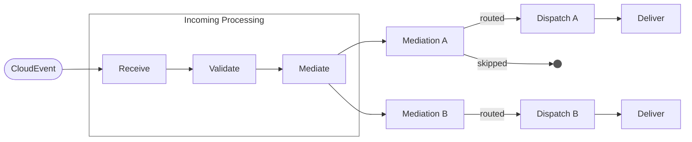
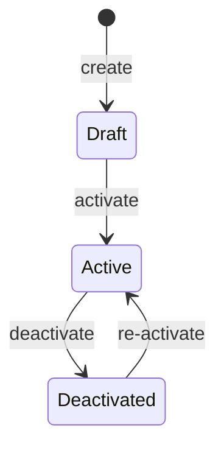
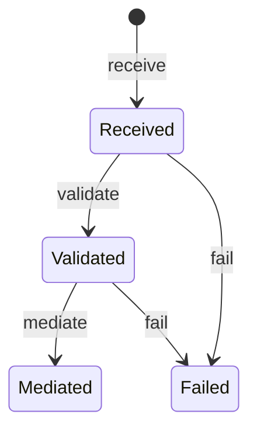
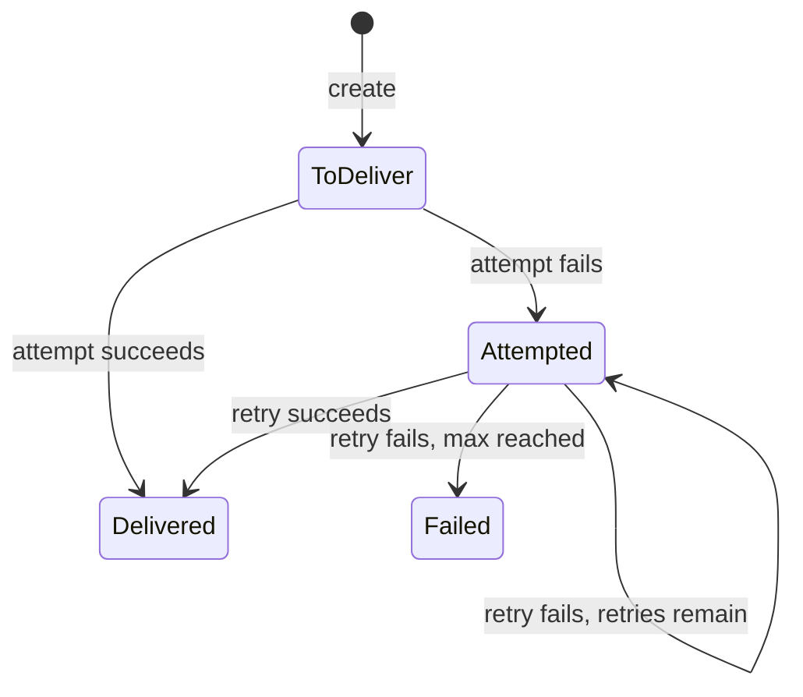

# OpenHIM Reusable Mediator

> A configurable mediator that sits between OpenHIM channels and downstream endpoints,
> applying pipelines of operations (filter, transform, enrich) to CloudEvents before
> routing them to third-party webhook destinations — with full lifecycle tracking
> from ingestion through delivery.

---

## Event Flow

---

## Aggregates

### [Mediation](mediation/)

Connects a source topic to a destination. Owns the pipeline of filter/transform/enrich
steps applied to each event on that route.

**Constraint:** Only one Mediation can be Active for a given topic+destination pair.

**Operations:** [Create](mediation/create-mediation) | [Activate](mediation/activate-mediation) | [Deactivate](mediation/deactivate-mediation) | [Mediate](mediation/mediate) | [Handle Event](mediation/handle-event)

---

### [Incoming Processing](incoming-processing/)

Tracks the lifecycle of an inbound CloudEvent from arrival through schema validation,
mediation, and outcome recording. Provides a persistent, inspectable audit trail.

**Operations:** [Receive Event](incoming-processing/receive-event) | [Validate Processing](incoming-processing/validate-processing) | [Mediate Processing](incoming-processing/mediate-processing) | [Fail Processing](incoming-processing/fail-processing)

---

### [Dispatches](dispatches/)

Tracks outbound event delivery to each destination with retry logic. Each dispatch
captures every delivery attempt with full HTTP response detail for observability.

**Operations:** [Create Dispatch](dispatches/create-dispatch) | [Record Delivery](dispatches/record-delivery)
